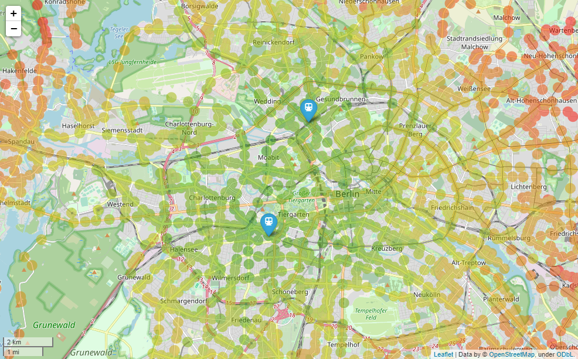
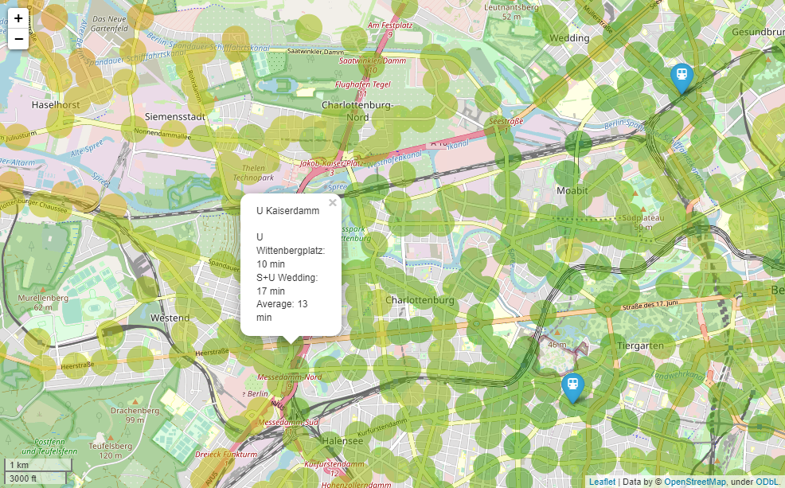

# Berlin Public Transport Reachability Map

Draw a map indicating reachability via public transport for specific destinations

Internally, the script makes use of...
* [Folium](http://python-visualization.github.io/folium/) for manipulating the map
* [Leaflet](http://leafletjs.com/) for displaying the map
* [OpenStreetMap](http://www.openstreetmap.org/) for the map data
* [transport.rest transit APIs](https://v5.bvg.transport.rest/api.html) for the public transport data

## Examples

Let's say we work in 'Wedding' at 'Wittenbergplatz'. Set those destinations in the settings.py configuration:
 ```python
DESTINATIONS = ['Wittenbergplatz', 'Wedding']
 ```

Then run the script:
 ```bash
 python3 main.py
 ```

The browser opens and displays the map. The map is interactive, so you can zoom in and out, and move around. 
The blue markers indicate your configured destinations. The green to red circles indicate the reachable stations.


Click any of the circles for details.


## Requirements

- Python 3.10+

## Installation

Clone project. Then...

```bash
pip install -r requirements.txt
```

## Usage

See settings.py for configuration..

```bash
python main.py
```


## License
[MIT](https://choosealicense.com/licenses/mit/)

Copyright (2022) Johannes Heller